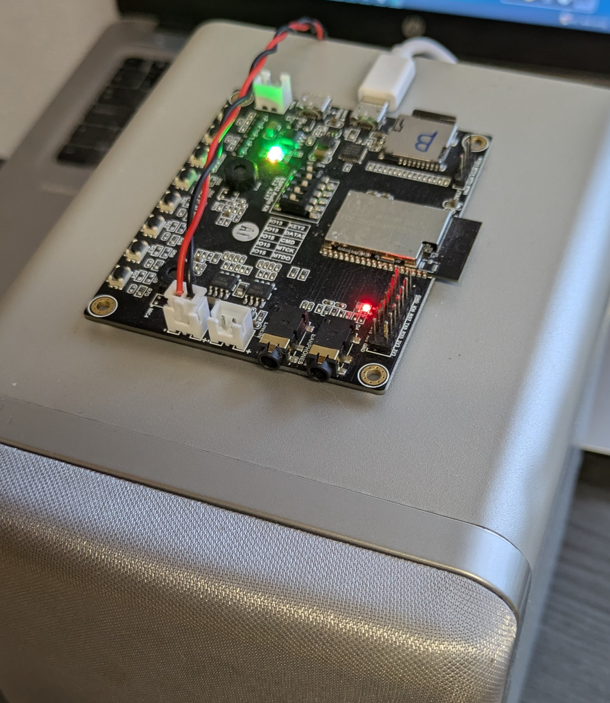
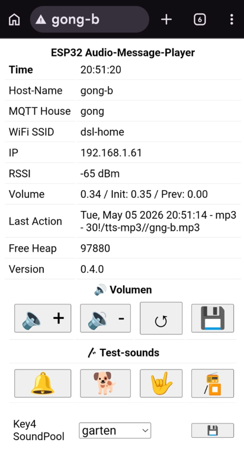
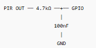

Summary of Audio-Message-Player - AMPlayer

The aim of this project is to develop an MP3 , TTS and Live Stream player that can be used for message and sound output in smart homes. The audio generated by text-to-speech is recorded and stored as an MP3 file on the SD card so that it can be played directly from there when called up again.

# Features:

- TTS (TextToSpeech): Google TTS free API (no registration needed)
- Playing MP3 audio are working offline, online connection needed for first tims use TTS and for long TTS Masseges
- Live Stream: Supports playback from online radio livestreams. (The internet connection quality must be very good because the AMPlayer has only a very small data buffer.)
- MQTT for Triggering AMPlayer actions
- FTP-Server use for one connection for upload of MP3-Files and setup of App.json. (Tested with WinCP)
- Queue for sequential playback of TTS and MP3 jobs and to avoid message overlap

* **Volume Control: Adjust playback volume using a message prefix.**
  The text for the TTS output can include a prefix (e.g., **80!Water in the basement**) that overrides the current player volume.
  This allows important or urgent messages to be played loudly, regardless of the user’s current volume settings — for example: **Water in the basement!**

- Each AMPlayer can subscribe to messages individually or as a group.
- Web UI for testing and control of the AMPlayer settings and functions.
- AudioGameBox for small children — supports connecting a push button to a GPIO pin to randomly play predefined sounds or short audio clips, such as horse, chicken, or other animal sounds.
- eDog  - (motion-triggered barking sounds with PIR sensor). Please see the pictures in the `/images` folder

## Features

# Hardware

- ESP32-Audio-Kit ESP32-A1S 4 MB oder 8 MB for 15-17€ on Aliexpress.
- 
- In Low Power Mode, the player consumes 0.5 watts

# SW Installation & Customizing

- Modify app.json on the SD card
- Upload the project to VS Code and Build firmware with PlatformIO and upload it to ESP32-A1S
- Or from  [https://nmaciol.github.io/ESP32-Audio-Message-Player-firmware/]()

# HW Installation

- The power supply can be provided using a standard phone charger connected to the USB power port on the ESP32 board.
- For the speaker connection or for powering the board from a battery, you will need cabel with an XH-2.5 / 2.54 mm connector.
- The board can be installed either inside a standard 100 × 100 mm electrical junction box from a hardware store or in a custom enclosure printed with a 3D printer.
- A quick way to test the board is by using the WebUI or the MyMQTT app on your smartphone.
- Warning! If you want to power the board with a battery, please note that the battery input requires 3.3 V. Make sure to read the documentation carefully before using the board in this configuration.
- You can connect passive speakers with 4 or 8 ohms to the board. These speakers can be purchased on eBay, or you can repurpose small speakers from an old stereo system or PC.

# Commissioning and Debugging

- When connecting the speaker and power **without an SD card**, the device plays an audio message:
  **Error 1 – SD card not found**

* After a successful startup with no errors, the player plays a doorbell to confirm it is ready. As soon as the device connects to MQTT server, its host name is announced.
* In **MQTT Explorer**, after startup, you can see a message [host]/IP containing the **IP address** of the device
* When sending an MQTT message to `[Host]/ping`, the player responds with its **basic configuration**, which can be viewed in MQTT
* Info:  If the connection to the MQTT server fails **20 times in a row**, the player will **automatically reboot**
* The player responds to the message `[host]/getLastAct` with `esp32/LastAction/[host]`. This functionality can be used to confirm that a message has been successfully played by the device.

## Power Saving Modes

The player supports two power-saving modes:

### 🔹 LPM [host]/lpm (Low Power Mode – Modem Sleep)

* Wi-Fi and Bluetooth are put into **standby mode**
* After a **TTS (Text-to-Speech) action**, the AMPlayer wakes up into active mode
* A **TTM action does NOT change the mode** – the AMPlayer remains in LPM
* To check if the AMPlayer is in LPM, send a **ping message
* *Power Saving is unavailable when the WebUI is enabled*

### 🔹 Sleep Mode [host]/sleep (Deep Sleep)

* The AMPlayer is put into **deep sleep mode for a defined number of seconds**
* During this time, the device is largely inactive to save maximum power

# Known issues

- Google TTS support short sentences only (Google limitation)
- The MQTT packet size is limited; messages and headers can be up to 256 bytes in size. If it to big then the ESP crashes and restarts
- The message queue was successfully tested using up to 10 KB of FreeHeep. There were about 60 messages.
- If the Internet connection is interrupted during a call to TTS services, the ESP crashes and restarts.
- The directory containing the cached MP3 files must not be too large, so please be careful. I have tested up to 1000 files.
- **Radio** playback is highly sensitive to **network quality**, as the player has a very small data buffer. With a reliable internet provider and a stable home router, radio streaming can run smoothly for hours without interruptions.

## Issue when compiling in VS Code

#### ESP32 Compatibility Fix (AudioTools HTTP Issue)

If you encounter a compilation error related to `setConnectionTimeout`, apply the following manual fix:

##### 📂 Open the file:

.pio/libdeps/esp32dev/audio-tools/src/AudioTools/Communication/HTTP/URLStream.h

🔎 Find these lines:

client\_secure->setConnectionTimeout(client\_timeout);
client\_insecure->setConnectionTimeout(client\_timeout);

✏️ Replace them with:

client_secure->setTimeout(client_timeout);
client_insecure->setTimeout(client_timeout);

### 🛠️ Fix SD Card Access Issue in FTP Server

To fix SD card access problems in the FTP server, you need to modify the storage backend definition.

##### 📂 File to edit:

.pio/libdeps/esp32dev/SimpleFTPServer/FtpServerKey.h

##### 🔎 Find this line (around line 63):

```
#define DEFAULT_STORAGE_TYPE_ESP32   STORAGE_SD
```

\_STORAGE\_TYPE\_ESP32   STORAGE\_SD

✏️ Replace it with:

```
#define DEFAULT_STORAGE_TYPE_ESP32   STORAGE_SD_MMC
```

## Unresolved issue

* Use of ESPAsyncWebServer causes conflicts with AudioTools/Communication/AudioHttp.

## Audio Format Support

The AMPlayer can only play MP3 files with a sampling rate of 44,100 Hz (44.1 kHz).

## Editing `app.json`

he `app.json` file is best edited using [WinSCP](https://winscp.net?utm_source=chatgpt.com) and [Notepad++](https://notepad-plus-plus.org?utm_source=chatgpt.com): simply download the file, make your changes locally in Notepad++, and upload it again afterward.

Please note that the player's FTP server supports only a single connection at a time. Attempting to open a second connection may result in errors.

Before uploading, it is recommended to always validate the format of the `app.json` file using the “JSON Tools” plugin for Notepad++.

## Jumper

- Jumper positions are: OFF,ON,ON,OFF,OFF

## SD-Card

- Format as FAT32
- Copy the directory structure from the provided SD card to your own SD card.
  Then rename `app.template.json` to `app.json` and configure the file according to your requirements.
- **If the SD card cannot be read, 3 LEDs light up on the board, , otherwise 2** and and a voice prompt will be heard.

## Audio Error Messages During Boot

During system startup, critical errors are **announced via the speaker**.

The following error conditions are supported:

- **Error 1 – Config file not exist**
  - The file `app.json` was not found
- **Error 2 – Config file error**
  - The JSON file is invalid or could not be parsed correctly.
- **Error 3 – Network connecting error**
  - The system failed to connect to the Wi-Fi network.

## Web  UI

The WebUI is primarily designed to control the Audio Messenger and can also be used for testing and diagnostics.

* Press and hold the Key4 switch for more than 10 seconds to turn the WebUI on or off
* URL for access within the local network: **http://[host-name]/**
* 

## MQTT Topics from the  Smart Home to MP3/TTS/LS Player

| Topic: Publish SmartHome      | Topic example          | value                                  | Description                                                                |
| :---------------------------- | ---------------------- | -------------------------------------- | -------------------------------------------------------------------------- |
| [host-name]/mp3               | gong-q/mp3             | /mp3/gong-a.mp3                        | Only [host-name] player are playing                                        |
| [host-name]/tts               | gong-q/tts             | Hallo Mp3-Player                       |                                                                            |
| [host-name]/ttm               | gong-q/ttm             | Hallo Mp3-Player                       | The audio file is cached as an MP3 file.                                   |
| [host-name]/delttm            | gong-q/delttm          | Hallo Mp3-Player                       | The audio file has been deleted from the cache.                            |
| [host-name]/ls/mp3            | gong-q/ls/mp3          | http://stream.srg-ssr.ch/m/rsj/mp3_128 | Livestream,  Radio player                                                  |
| [host-name]/stop              | gong-q/stop            | .                                      |                                                                            |
| [host-name]/setVol            | gong-q/setVol          | 0.80                                   | max. Value 1 .00    Set the player volume. Save it into the app.json file. |
| [host-name]/incVol            | gong-q/incVol          | 0.05                                   | max. Value 1.00    Increase or decrease volume                             |
| [host-name]/resVol            | gong-q/resVol          |                                        | Set the default volume.                                                    |
| [host-name]/reboot            | gong-q/reboot          | .                                      |                                                                            |
| [host-name]/speed             | gong-q/speed           | .                                      | Applies only to TTS and new TTM files                                      |
| [host-name]/lpm               | gong-q/lpm             | .                                      | Low Mode                                                                   |
| [host-name]/sleep             | gong-q/sleep           | 100                                    | Seep Sleep Mode in seconds                                                 |
| [host-name]/enable/webui      | gong/enable/webui      | on or off                             | Enable or disable the WebUI server                                         |
| [host-name]/enable/ftp        | gong/enable/ftp        | on or off                             | Enable or disable the FTP server                                           |
| [host-name]/enable/mqtt       | gong/enable/mqtt       | on or off                             | Enable or disable the MQTT server                                          |
| [host-name]/enable/stop2press | gong/enable/stop2press | on or off                             | Enable or disable the Stop2Press server                                    |
| [host-name]/press/key4        | gong/pressKey4         |                                       | Start play sound/audio from pool                                    |
|                               |                        |                                        |                                                                            |
| [mqtt-house]/mp3              | gong/mp3               | /mp3/gong-a.mp3                        | Play all players from the group [mqtt-house]                               |
| [mqtt-house]/tts              | gong/tts               | Hallo                                  |                                                                            |
| [mqtt-house]/tts              | gong/tts               | 80!Hallo                               | at 80% volume, Hallo                                                       |
| [mqtt-house]/ttm              | gong/ttm               | Hallo                                  | The audio file is cached as an MP3 file.                                   |
| [mqtt-house]/ls/mp3           | gong/ls/mp3            | http://stream.srg-ssr.ch/m/rsj/mp3_128 | Livestream                                                                 |
| [mqtt-house]/stop             | gong/stop              | .                                      |                                                                            |
| [mqtt-house]/stop             | gong/lpm               | on                                     | Low Power Mode                                                             |
| [mqtt-house]/setVol           | gong/setVol            | 0.80                                   | max. Value 1 .00    Set the player volume                                  |
| [mqtt-house]/incVol           | gong/incVol            | 0.05                                   | max. Value 1.00    Increase or decrease volume                             |
| [mqtt-house]/incVol           | gong/resVol            | on or off                             | Set the default volume. Save it into the app.json file.                    |

## Possible prefixes for TTS actions

* 80!Hallo               -> 80% volume
* en!I'm live             -> speak english
* pl!Dzień dobry     -> speak Polish

## MQTT Topics from the Player for Smart Home:

| Topic  Smart Home      | Value | Topic: Publish Player                                                                                                                                                                                                                                   | Value       | Description                       |
| :--------------------- | :---- | ------------------------------------------------------------------------------------------------------------------------------------------------------------------------------------------------------------------------------------------------------- | ----------- | --------------------------------- |
| [host-name]/ping       |       | [host-name]/FreeHeap<br />[host-name]/version <br />[host-name]/currVol <br />[host-name]/IP <br />[host-name]/SSID<br />[host-name]/LastAction <br />[host-name]/LastAction <br />[host-name]/sleepMode <br />[host-name]/rssi <br />[host-name]/time |             | To get Version, FreeHeap etc     |
|                        | .     | esp32/error                                                                                                                                                                                                                                             | [host-name] | In case of an internal error      |
|                        | .     | [mqtt-house]/IP                                                                                                                                                                                                                                         |             | If setup has run successfully     |
| [host-name]/getLastAct | .     | `esp32/LastAction/[HOST_NAME]/LastAction`                                                                                                                                                                                                             | LastAction  | Reports the last action performed |

## Buttons:

| Button | Description                       | GPIO |
| :----- | --------------------------------- | ---- |
| Key3   | Stop play                         | 19   |
| Key4   | Play the test sound == PIR motion | 23   |
| Key5   | Volume down                       | 18   |
| Key6   | Volume up                         | 05   |

## eDog Extension: PIR Sensor or Push Button via KEY4 (NO Input)

#### Purpose

The goal of this extension is to develop an **AudioBox** that can be used flexibly as an **eDog** or **AudioGameBox**.

The extension is designed for two main use cases:

* **Security / deterrence mode:** playback of audio content to deter unauthorized persons from entering the property
* **Children’s game mode:** interactive use with audio content for entertainment and play

#### Description

The **`soundPool`** field refers to a named array defined in the `soundPools` object that contains arrays of audio commands, also known as sounds.

Each entry in the referenced array represents an action command. Each command begins with a prefix that determines the type of action to be performed.

* **tts / ttm**: The command is treated as text-to-speech input, followed by the text to be spoken.
* mp3: The command refers to an audio file, including its file name and path on the SD card.
* ls! : The command plays a live stream (radio station)

When triggered, the system processes each entry in the selected `soundPool` and executes the corresponding actions according to their prefixes.

* **tts / ttm**: followed by the text to be spoken
* mp3: followed by the file name and path on the SD card

When the Key4 key is pressed and If the interval since the last release time is exceeded, the system randomly selects an element from the selected audio pool (soundPool) and performs the appropriate actions based on its prefix.

The  Key-Value  "interval" in app.json defines the **minimum interval between two playback events**, ensuring that actions are not triggered too frequently.

The `Key-Value "stop2press"` stops the currently playing sound/audio when the button is pressed again before the interval has elapsed. Once the interval has elapsed, the button must be pressed three times.

For development, I used a **“3V–24V LED PIR sensor switch with 3.3V high-level serial signal output”** and a **“2.54 mm dual-row straight socket, 2 × 7 pins pin header connector”**, both purchased from AliExpress, to test the player.

**You can easily test this feature using the “Key4” button** on the board.


The GPIO IO23/Key4 input must be protected by an RC filter to suppress noise, bounce, or interference at the input.



## ☕If you like this project, you can support me here:

[https://buymeacoffee.com/nmaciol]()

## Origin

The development is based on the work of Phil Schatzmann. I also used various libraries from different authors to realize my vision of an intelligent MP3/TTS player for smart home use.

[https://github.com/pschatzmann/arduino-audio-tools](https://)
[https://github.com/greiman/SdFat.git](https://)
[https://github.com/knolleary/pubsubclient.git](https://)
[https://github.com/xreef/SimpleFTPServer.git](http://www.mischianti.org/))
[https://github.com/georg-koch/Arduino-QueueList.git](https://)
[https://github.com/stevemarple/IniFile.git](https://)
[https://github.com/nickgammon/Regexp.git](https://)
